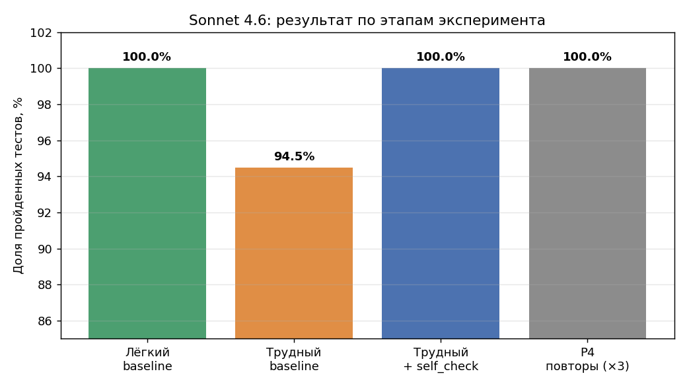

# Может ли скил самопроверки улучшить сильную модель на типовых задачах?

**Пилотный эксперимент по проверке скила `self_check` для Claude Sonnet 4.6
на задачах Python и Telegram-ботах (aiogram 3.x).**

Автор эксперимента: Андрей Шашев (ShashevPro)
Дата: июнь 2026. Результат: **отрицательный и воспроизводимый.**

---

## Коротко (TL;DR)

Я хотел проверить популярную идею: можно ли с помощью «скила» —
короткой инструкции, написанной более сильной моделью, — заметно
повысить качество работы модели Sonnet 4.6 на типовых задачах
программиста-фрилансера.

Результат: **на типовых, хорошо описанных задачах Python и aiogram
Sonnet 4.6 уже работает близко к потолку, и скил самопроверки не дал
измеримого прироста — улучшать оказалось практически нечего.**
Единственная ошибка, которую мы наблюдали, при повторной проверке
не воспроизвелась, то есть была случайным сбоем генерации, а не
системной слабостью.

Это не провал, а честный отрицательный результат. Ниже — как именно
мы к нему пришли, со всеми данными и возможностью воспроизвести.



---

## Что проверяли и чего НЕ проверяли

**Проверяли:** помогает ли скил `self_check` (инструкция «перечитай и
мысленно запусти свой код перед сдачей») модели Sonnet 4.6 на 16
типовых задачах: 8 на чистом Python и 8 на ботах aiogram 3.x.

**НЕ проверяли** (и не делаем об этом выводов):
- скилы вообще как класс — мы тестировали один конкретный скил;
- более слабые модели — возможно, им скилы помогают;
- длинные автономные сценарии (агенты, многочасовая работа);
- задачи за гранью возможностей модели.

Честная статья очерчивает границы того, что измерено. За этими
границами наш результат ничего не утверждает.

---

## Методология

Принципы, заложенные до старта (зафиксированы в `CRITERION.txt`
первым коммитом — предрегистрация):

1. **Объективная метрика.** Главный критерий — доля автоматических
   тестов (pytest), которые проходит код, сгенерированный моделью.
   Не мнение судьи, а «проходит / не проходит».
2. **Базовая линия.** Сначала измеряем модель без скила, потом со
   скилом, на тех же задачах.
3. **Контрольный набор (holdout).** 6 из 16 задач не показывались
   модели на этапе настройки скила.
4. **Проверка на воспроизводимость.** Любой наблюдаемый эффект
   перепроверяется повторными прогонами (модель стохастична).
5. **Публикуем результат любым** — положительным, нулевым или
   отрицательным.

### Инструменты
- Модель-исполнитель: **Claude Sonnet 4.6** (через подписку Claude Pro).
- Среда тестов: Python 3.11, pytest, aiogram 3.x; тесты прогонялись
  локально (бесплатно), лимиты тратились только на генерацию кода.
- Разделение «без скила / со скилом» — через два проекта в claude.ai:
  `EXP-Baseline` (пустые инструкции) и `EXP-Skilled` (скил в
  инструкции проекта). Обе группы работали на одинаковом стандартном
  наборе навыков claude.ai; экспериментальной добавкой был только
  `self_check`.

---

## Ход эксперимента и результаты

| Этап | Что делали | Результат (тесты) |
|------|------------|-------------------|
| Лёгкий baseline | 16 типовых задач без скила | **95/95 (100%)** |
| Трудный baseline | 16 усложнённых задач без скила | **120/127 (94.5%)** |
| Трудный + self_check | 5 задач со скилом | **39/39 (100%)** |
| Повтор P4 ×3 | контроль воспроизводимости | **21/21 (100%)** |

### Этап 1. Лёгкий baseline → 100%
Первые 16 задач Sonnet решила идеально. Вывод: задачи были слишком
простыми, чтобы на них что-то измерять. Это **первый результат**: на
простом уровне разницы быть не может, потолок достигается без скилов.

### Этап 2. Трудный baseline → 94.5%
Задачи переписали на действительно коварные (строгая валидация
римских чисел, парсер выражений без `eval`, сравнение semver,
скользящие окна и т.п.) — с однозначными условиями, но обилием
крайних случаев. Из 16 задач Sonnet прошла 15. Единственный провал —
задача P4 (сравнение версий semver): логика была написана **верно**,
но код не запустился из-за синтаксической ошибки в f-строке, которую
модель не заметила.

> Важная честная поправка: ещё одна задача (B2) сначала показала
> «провал», но при разборе выяснилось, что ошибка была **в нашем
> тесте** — он зависел от имени внутренней переменной, которое мы не
> зафиксировали в условии. Тест исправлен, код Sonnet оказался
> полностью корректным (9/9). Эту ошибку методологии мы фиксируем
> открыто.

### Этап 3. Скил self_check → P4 прошла
Дали Sonnet тот же P4, но со скилом самопроверки. Задача прошла
7/7. Контрольные задачи (P3, B2, B4, B5) скил не сломал.

**Но:** в JSON-отчёте самопроверки модели той самой синтаксической
ошибки, что убила baseline, **не было** в списке найденных. То есть
скил не «нашёл и починил» прошлый баг — модель просто в этот раз
написала код иначе. Это могло быть как эффектом скила, так и простой
случайностью. Различить по одному прогону невозможно.

### Этап 4. Контроль воспроизводимости → эффект не подтвердился
Прогнали P4 **без скила** ещё 3 раза. Все 3 раза — 7/7. Значит,
исходный провал P4 был **случайным сбоем генерации**, а не устойчивой
слабостью. Следовательно, **приписать заслугу скилу нельзя**: без
скила задача и так решается стабильно.

---

## Вывод

На типовых, хорошо описанных задачах Python и aiogram модель
Sonnet 4.6 со стандартным набором навыков Anthropic уже работает
близко к потолку. Скил самопроверки `self_check` **не дал измеримого
прироста** — улучшать оказалось практически нечего. Единственная
наблюдавшаяся ошибка не воспроизвелась при повторных прогонах, то есть
была случайным сбоем, а не системной проблемой, которую скил мог бы
закрыть.

**Побочное наблюдение:** скил самопроверки склонен к ложным
срабатываниям — модель «находит 3 проблемы» даже там, где их нет
(в одном из отчётов честно написала «исправление не требуется»).
Это стоит учитывать тем, кто внедряет подобные скилы: они добавляют
объём вывода и могут провоцировать переусложнение рабочего кода.

**Чего вывод НЕ означает:** что скилы бесполезны вообще. На задачах
за гранью возможностей модели, на более слабых моделях или в длинных
автономных сценариях скилы вполне могут давать эффект — но это
предмет других экспериментов.

---

## Ограничения исследования

Честно перечисляю слабые места — они важны для интерпретации:

- **Малая выборка** (16 задач). Это пилот, а не масштабное
  исследование. Выводы предварительные.
- **Один автор задач, тестов и скила.** Задачи, тесты и скил
  готовила одна модель-помощник (в роли «учителя»). Идеальный дизайн
  делал бы их независимыми. Тесты проверены на исполнимость
  (эталонные решения), но не на независимость от автора.
- **Смена ведущей модели по ходу.** Изначально на роль «учителя»
  планировалась модель Fable 5; в ходе эксперимента доступ к ней был
  внешне ограничен, и роль перешла к Opus 4.8. На итог это не влияет
  (учитель лишь готовил задачи и скил), но честно фиксируем.
- **Один прогон на задачу** в baseline (кроме P4, где сделали 3).
  Стохастичность модели полностью не усреднена.

---

## Как воспроизвести

```bash
# 1. Проверить, что тесты валидны (проходят на эталонных решениях)
STAGE=reference_hard python -m pytest tasks_hard/ -v   # 127 passed

# 2. Прогнать решение модели (пример)
#    Сохранить ответ модели в outputs/<stage>/<ID>.py, затем:
STAGE=baseline_hard python -m pytest tasks_hard/test_P4.py -v
```

Структура репозитория описана в [`STRUCTURE.md`](STRUCTURE.md).
Сырые данные — в [`results.csv`](results.csv). Скил — в
[`skills/v1/self_check.md`](skills/v1/self_check.md). Все ответы
модели сохранены в `outputs/` по этапам.

---

## Лицензия и благодарности

Эксперимент проведён в открытом виде ради честной проверки гипотезы.
Данные и код открыты для перепроверки и критики. Замечания и
воспроизведения приветствуются.
[Read the full article on Medium](https://medium.com/p/a069576684d5)

- 🌐 [shashevpro.ru](https://www.shashevpro.ru)
- 🛒 [kwork.ru/user/shashevpro](https://kwork.ru/user/shashevpro)
- ✉️ programmer@shashevpro.ru
- 💬 [vk.com/shashevpro](https://vk.com/shashevpro)
